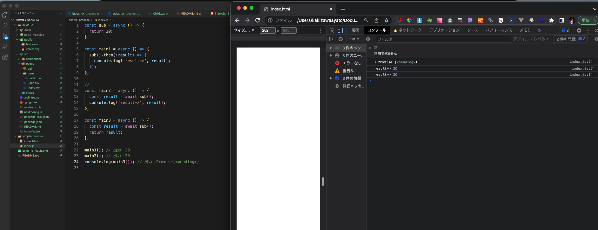
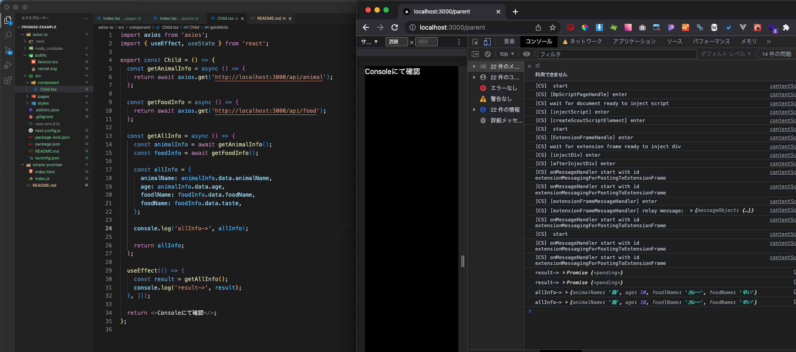

# 本リポジトリについて

メソッド内の axios で取得したレスポンスをメソッド呼び出し元に返却することを目的にいろいろ試したリポジトリ

## 確認内容

`simple-promise` → js ファイルで Promise 型の動きを確認 
`axios-io` → axios を使用し、メソッド呼び出し元に返却できることを確認（Next.js） 

# 出力結果

## simple-promise

## axios-io

